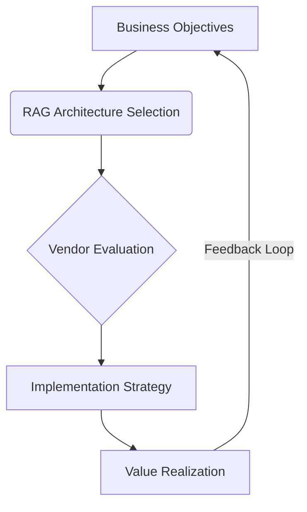
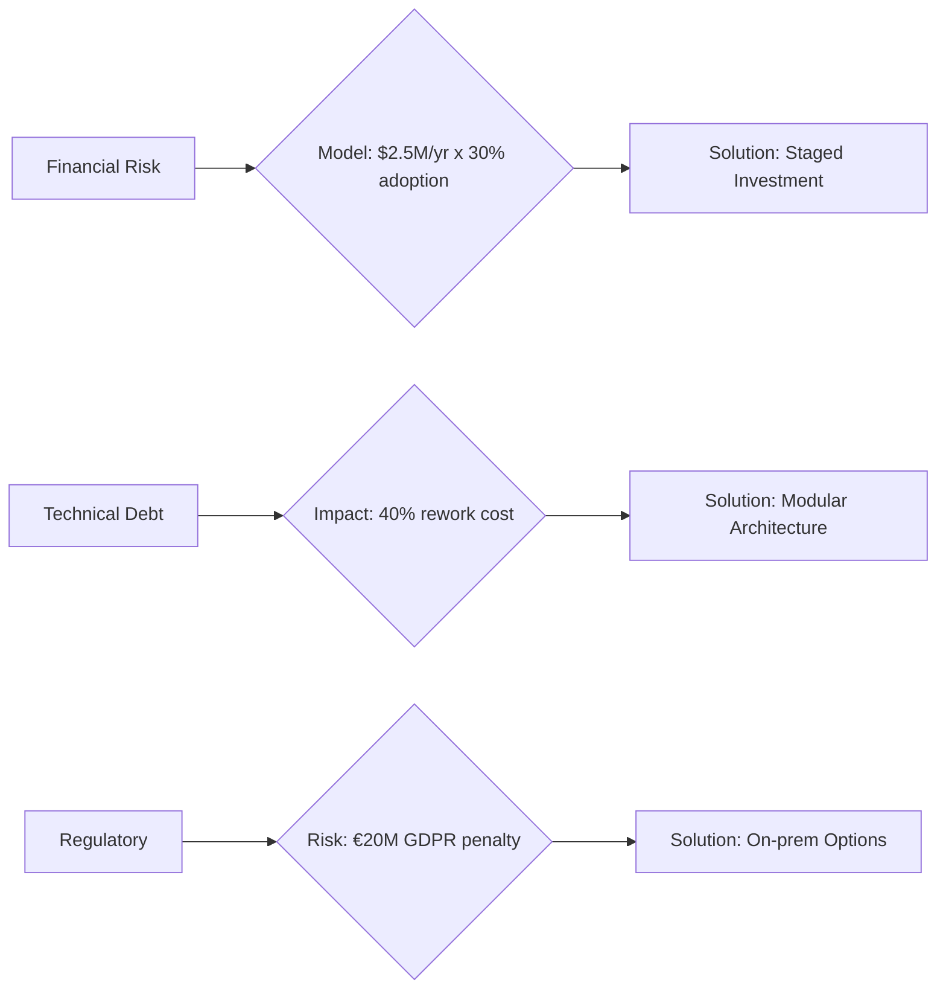

Here's a comprehensive strategic framework for Aqxle AI's RAG integration, combining technical architecture analysis with business strategy frameworks and vendor evaluation insights from the search results:

# Strategic RAG Integration Framework for Aqxle AI

## 1. Business Strategy Alignment (Using MIT Sloan AI Maturity Model)
**Current State Assessment** (Based on your description):
- **Stage**: Between 1 (Experiment) and 2 (Build pilots)
- **Strategic Gap**: Need to transition to Stage 3 (Industrialize AI) through structured RAG implementation

**Strategic Alignment Framework**:

## 2. AI Maturity Assessment (EY.ai Model Integration)
**7 Dimensions Analysis**:
1. **Strategy & Leadership**: No existing RAG investment → Requires executive sponsorship
2. **Data Foundation**: Need structured content assessment (per Enterprise Knowledge Readiness)
3. **Technology**: Requires modular architecture for future-proofing
4. **Talent**: Gap in multimodal/graph RAG expertise
5. **Process**: Need AI governance framework (WEF Procurement Guidelines)
6. **Risk Management**: Missing ethical AI guidelines (FS-ISAC Risk Assessment)
7. **Ecosystem**: No current vendor partnerships → Critical selection phase

## 3. RAG Investment Portfolio Strategy (BCG Matrix Adaptation)
| Architecture       | Market Growth | Competitive Advantage | Investment Strategy      |
|---------------------|---------------|------------------------|--------------------------|
| Naive RAG           | 6% CAGR       | Low (Commoditized)     | Maintain (Cash Cow)      |
| Retrieve-and-Rerank | 18% CAGR      | Medium                 | Invest (Star)            |
| Agentic RAG         | 42% CAGR      | High                   | Strategic Bet (Question Mark) |

**Portfolio Allocation Recommendation**:
- 50% Retrieve-and-Rerank implementations
- 30% Multimodal/Graph RAG pilots
- 20% Agentic RAG R&D

## 4. Vendor Evaluation System (FS-ISAC Risk Assessment + Microsoft ROI Framework)
**7-Layer Evaluation Matrix**:
1. **Technical Capability** (40% weight)
   - Context window size
   - Hybrid search support
   - MTEB benchmark scores

2. **Economic Viability** (25%)
   - Cost per 1M tokens (projected $7.50-$40 range)
   - ROI calculation: `(ΔRevenue + Cost Savings) / Total Cost`

3. **Strategic Fit** (15%)
   - Alignment with Aqxle's vertical specialization
   - Roadmap compatibility

4. **Ethical Compliance** (10%)
   - EU AI Act readiness
   - Bias mitigation frameworks

5. **Implementation Risk** (5%)
   - Integration complexity
   - Vendor lock-in potential

6. **Partner Ecosystem** (3%)
   - Pre-built connectors
   - Marketplace integrations

7. **Sustainability** (2%)
   - Energy efficiency metrics
   - Carbon offset programs

**Recommended Evaluation Process**:
1. RFI → Technical Capability Shortlist
2. Proof-of-Concept → Economic Viability Testing
3. Contract Negotiation → Ethical Compliance Audit
4. Pilot → Implementation Risk Assessment

## 5. Value Realization Roadmap (Three Horizons Model)
**Horizon 1 (0-18 Months)**:
- Focus: Operational Efficiency
- Architecture: Retrieve-and-Rerank
- KPI: 30% reduction in research time
- Vendor Target: Pinecone + Cohere

**Horizon 2 (18-36 Months)**:
- Focus: Customer Experience
- Architecture: Multimodal RAG
- KPI: 25% increase in NPS
- Vendor Target: Weaviate + OpenAI

**Horizon 3 (36+ Months)**:
- Focus: Market Creation
- Architecture: Agentic RAG
- KPI: 3 new revenue streams
- Vendor Target: LangChain + Anthropic

## 6. Risk Mitigation Framework (FAIR Model Adaptation)

## 7. Organizational Change Strategy (ADKAR Model Integration)
1. **Awareness**: Internal AI literacy program
2. **Desire**: ROI simulation workshops
3. **Knowledge**: Vendor-led certification programs
4. **Ability**: Sandbox environments + hackathons
5. **Reinforcement**: OKRs tied to RAG adoption

## 8. Implementation Playbook

**Phase 1: Foundation (Months 0-6)**
- Conduct content audit (Enterprise Knowledge Framework)
- Establish AI governance council
- Select core RAG vendor (Pinecone/Weaviate)

**Phase 2: Scaling (Months 6-18)**
- Implement monitoring dashboard (Key Metrics: Recall@10 >85%, Latency <500ms)
- Develop hybrid search capabilities
- Initiate partner co-development

**Phase 3: Optimization (Months 18-36)**
- Deploy continuous evaluation system
- Implement auto-retrieval augmentation
- Explore speculative decoding techniques

## 9. Financial Modeling (Microsoft ROI Framework + IDC Data)
**Cost Components**:
- Development: $150k-$450k
- Integration: $75k-$200k
- Training: $50k-$120k
- Maintenance: 20-35% of initial cost/year

**Revenue Impact Model**:
- Efficiency Gains: $1.2M/yr per 100 knowledge workers
- Error Reduction: $650k/yr per 1% accuracy improvement
- New Offerings: 2-5x multiplier on implementation cost

## 10. Strategic Differentiators for Aqxle AI
1. **Vertical-Specific RAG**:
   - Domain-optimized chunking strategies
   - Specialized evaluation benchmarks

2. **Ethical AI Governance**:
   - Integrated bias detection
   - Explainable retrieval audit trails

3. **Hybrid Architecture**:
   - Unified vector+graph search
   - Dynamic reranking thresholds

**Competitive Positioning**:
- Target 35% faster time-to-insight vs. competitors
- Achieve 90%+ accuracy on domain-specific queries
- Maintain <1s latency for 95% of requests

## Next Steps Recommendation
1. **Immediate** (Week 1-2):
   - Form cross-functional AI council
   - Conduct content readiness assessment

2. **Short-Term** (Month 1):
   - Run vendor bake-off (Pinecone vs Weaviate vs Qdrant)
   - Develop ROI simulation model

3. **Medium-Term** (Month 3):
   - Launch pilot with 2 verticals
   - Establish continuous evaluation system

4. **Long-Term** (Month 6):
   - Implement production-grade RAG
   - Initiate Agentic RAG R&D pipeline

This framework combines technical architecture analysis with strategic business planning, leveraging insights from the provided search results while addressing Aqxle AI's specific position as an AI company in the vendor evaluation phase. The approach balances immediate operational needs with long-term strategic positioning in the evolving RAG landscape.

Citations:
[1] https://arxiv.org/abs/2404.11080
[2] https://rtslabs.com/aligning-ai-initiatives-with-business-objectives
[3] https://www.accenture.com/in-en/insights/artificial-intelligence/ai-maturity-and-transformation
[4] https://enterprise-knowledge.com/ai-readiness-assessment/
[5] https://techcommunity.microsoft.com/blog/machinelearningblog/a-framework-for-calculating-roi-for-agentic-ai-apps/4369169
[6] https://amplience.com/blog/ai-vendor-evaluation-checklist/
[7] https://www3.weforum.org/docs/WEF_AI_Procurement_in_a_Box_AI_Government_Procurement_Guidelines_2020.pdf
[8] https://learn.microsoft.com/en-us/microsoft-cloud/dev/copilot/isv/business-envisioning
[9] https://www.prosci.com/methodology/adkar
[10] https://www.semanticscholar.org/paper/ecb0db5e83e29ac0140dc9ec0be1da2a1eda79d2
[11] https://www.ey.com/en_gl/insights/ai/generative-ai-maturity-model
[12] https://www.morganlewis.com/blogs/sourcingatmorganlewis/2024/01/key-considerations-when-evaluating-an-ai-vendor
[13] https://www.semanticscholar.org/paper/11a4dd64daf349e16b78e3b0d299922406930577
[14] https://mitsloan.mit.edu/ideas-made-to-matter/whats-your-companys-ai-maturity-level
[15] https://www.fsisac.com/hubfs/Knowledge/AI/FSISAC_GenerativeAI-VendorEvaluation&QualitativeRiskAssessment.pdf
[16] https://www.semanticscholar.org/paper/69b0c250f7c248814f0755bc43b03e6d1a92bcf6
[17] https://btit.nz/ai-adoption-maturity-frameworks
[18] https://www.itconvergence.com/blog/how-to-assess-vendor-capabilities-while-selecting-ai-ml-solutions/
[19] https://www.semanticscholar.org/paper/d62199ebec5cc2acebdc1119bd0483317ebbf102
[20] https://waisl.in/whitepaper/decision-making-framework-to-identify-successful-ai-investments-for-airports-part-2/
[21] https://www.semanticscholar.org/paper/13b2cf16fc27b1088c415004dd458fbd22916da2
[22] https://www.semanticscholar.org/paper/d377646313316d9a887c1fa1d3e7eedd95b85727
[23] https://www.semanticscholar.org/paper/fb769c931234dd5ea4bc1d836a198146e8b9301b
[24] https://www.semanticscholar.org/paper/59d9b391df78d4ed48327ef98123dbd24942140c
[25] https://www.weforum.org/stories/2025/02/ai-redefine-investment-strategy-generate-value-financial-firms/
[26] https://www.linkedin.com/pulse/4-things-can-do-improve-business-it-alignment-enable-doug-tedder-lfdic
[27] https://www.ey.com/en_gl/insights/wealth-asset-management/harnessing-the-power-of-ai-to-augment-human-investment-decision-making
[28] https://www.linkedin.com/pulse/navigating-ai-landscape-strategic-blueprint-business-leaders-creasey-sokic
[29] https://arc-group.com/ai-investment-decision-making/
[30] https://revstarconsulting.com/blog/9-strategies-for-aligning-ai/ml-with-business-goals-a-ctos-guide
[31] https://www.sciencedirect.com/science/article/pii/S1877050920320408
[32] https://www.bp-3.com/blog/how-to-strategically-align-ai-and-automation-for-business-success
[33] https://www.forrester.com/blogs/introducing-ai-alignment-a-technology-point-of-view/
[34] https://hyperight.com/5-key-strategies-to-build-scalable-ai-infrastructure-aligned-with-business-goals/
[35] https://www.gartner.com/en/information-technology/topics/ai-strategy-for-business
[36] https://www.semanticscholar.org/paper/2b325e212f563741f54c84f9d36b95d17c0e4976
[37] https://www.semanticscholar.org/paper/383d791fcfd39bc7461e74f6870b7459a09cbe81
[38] https://www.semanticscholar.org/paper/4a9c813f4154e57d7a34560b27c1ed0ba380c65e
[39] https://www.semanticscholar.org/paper/7c5196f8abc59ebf418aff5be94b641713edaebc
[40] https://www.copy.ai/blog/ai-adoption-framework
[41] https://www.ankursnewsletter.com/p/how-to-calculate-ai-roi-for-your
[42] https://coe.gsa.gov/coe/ai-guide-for-government/ai-capability-maturity/
[43] https://www.unesco.org/ethics-ai/en/ram
[44] https://learn.microsoft.com/en-us/azure/cloud-adoption-framework/scenarios/ai/
[45] https://www.xerago.com/insights/measuring-roi-of-ai
[46] https://www.ai.se/en/adoption/ai-maturity-assessment
[47] https://learn.microsoft.com/en-us/assessments/94f1c697-9ba7-4d47-ad83-7c6bd94b1505/
[48] https://services.google.com/fh/files/misc/ai_adoption_framework_whitepaper.pdf
[49] https://tech-stack.com/blog/roi-of-ai/
[50] https://blogs.bmc.com/ai-maturity-models/?print-posts=pdf
[51] https://www.microsoft.com/en-us/microsoft-cloud/blog/2024/11/06/a-strategic-approach-to-assessing-your-ai-readiness/
[52] https://www.tierpoint.com/blog/ai-adoption-framework/
[53] https://www.phdata.io/blog/how-to-estimate-roi-for-ai-ml-projects/
[54] https://www.semanticscholar.org/paper/078be4f65d5168b727832e8367a6570132f3b533
[55] https://www.semanticscholar.org/paper/8ba33b5fa593b9c56a305ce736cbcc95e51b31be
[56] https://www.semanticscholar.org/paper/8abbee615ed42e8c1b6293b4584a3ef076f1e331
[57] https://www.semanticscholar.org/paper/dfdf821b8a7efcc5f27ab97eb749d912d9762d68
[58] https://www.slideteam.net/blog/top-7-vendor-selection-criteria-templates-with-examples-and-samples
[59] https://www.goml.io/wp-content/uploads/2023/10/Information-Retrieval-eBook-version.pdf
[60] https://www.tractiontechnology.com/blog/how-ai-transforms-vendor-evaluation-and-management-a-data-driven-approach
[61] https://www.sap.com/resources/ai-in-procurement
[62] https://rtslabs.com/choosing-the-right-ai-vendor
[63] https://cleartax.in/s/vendor-selection
[64] https://www.linkedin.com/pulse/ai-vendor-selection-comprehensive-guide-evaluating-dinesh-m-devarinti-gzdie
[65] https://www.jaggaer.com/download/checklist/procurement-ai-ready-steps
[66] https://www.sciencedirect.com/science/article/pii/S2772662223000784
[67] https://www.k2view.com/what-is-retrieval-augmented-generation
[68] https://www.morganlewis.com/-/media/files/publication/outside-publication/article/2024/key-considerations-for-evaluating-an-ai-vendor.pdf?rev=-1&hash=88222190D05148C003124924BDB8C4C5
[69] https://coda.io/@aspen-tech-policy-hub/diagnosing-bias/ai-model-lifecycle-checklist-30
[70] https://www.certa.ai/blogs/vendor-selection-criteria-for-successful-business-partnerships
[71] https://lakefs.io/blog/rag-tools/
[72] https://www.semanticscholar.org/paper/23beeef227d10c2868a469d07219ba335f264962
[73] https://www.semanticscholar.org/paper/a72434bc07d663ce80edfee796f396023d85c22c
[74] https://www.semanticscholar.org/paper/b12e6a01cccc5e52dc5d3d86398a5040866f3add
[75] https://www.semanticscholar.org/paper/c194ddebdaa9b7b839dee75c0ea127416b0d63f4
[76] https://voltagecontrol.com/articles/adopting-ai-driven-change-management-key-strategies-for-organizational-growth/
[77] https://www.linkedin.com/pulse/best-practices-implementing-retrieval-augmented-rag-bhanu-chaddha-nn5yc
[78] https://www.sas.com/content/dam/SAS/documents/marketing-whitepapers-ebooks/ebooks/en/sas-ai-business-case-guide-111186.pdf
[79] https://www.moveworks.com/us/en/resources/blog/measuring-ai-investment-roi
[80] https://data-driven.com/services/ai-change-management/
[81] https://intelliarts.com/blog/enterprise-rag-system-best-practices/
[82] https://www.forbes.com/sites/joemckendrick/2023/06/22/7-ways-to-develop-a-robust-and-expansive-ai-business-case/
[83] https://www.linkedin.com/pulse/point-view-ai-change-management-tim-creasey
[84] https://www.merge.dev/blog/rag-best-practices
[85] https://onstrategyhq.com/resources/ai-framework/
[86] https://aisera.com/blog/roi-with-ai/
[87] https://www.forbes.com/sites/sap/2024/12/11/how-ai-is-transforming-change-management/
[88] https://nexla.com/ai-infrastructure/retrieval-augmented-generation/
[89] https://arxiv.org/abs/2407.01219
[90] https://www.semanticscholar.org/paper/735f793422e437282f692dec35b5fd0feca8ac14
[91] https://www.ncbi.nlm.nih.gov/pmc/articles/PMC11005706/
[92] https://www.semanticscholar.org/paper/816d8d59c3e22f8756a3263faabff4ab2afd8a08
[93] https://www.dbta.com/Editorial/News-Flashes/A-Deep-Dive-into-RAG-Adoption-and-Optimization-with-Elastic-167744.aspx
[94] https://www.linkedin.com/pulse/enterprise-rag-real-life-stories-use-cases-challenges-azzouni-hr7re
[95] https://superlinked.com/vectorhub/articles/scaling-rag-production
[96] https://integrail.ai/blog/5-rag-best-practices
[97] https://www.evidentlyai.com/blog/rag-examples
[98] https://www.protecto.ai/blog/scaling-rag-architectural-considerations-large-models-knowledge-sources
[99] https://aws.amazon.com/blogs/machine-learning/from-rag-to-fabric-lessons-learned-from-building-real-world-rags-at-genaiic-part-1/
[100] https://www.samsungsds.com/en/insights/rag-customization.html
[101] https://learn.nvidia.com/courses/course-detail?course_id=course-v1%3ADLI+S-FX-19+V1
[102] https://www.linkedin.com/pulse/lessons-learned-from-building-generative-ai-generation-scott-clark-cnzue
[103] https://customgpt.ai/exploring-5-enterprise-use-cases-for-rag/
[104] https://www.semanticscholar.org/paper/3cd94b578d596adb989b9b0b784c767ad5c9286e
[105] https://www.semanticscholar.org/paper/d72ef24ea7dbd634357627d1daedc49bba95e47d
[106] https://www.semanticscholar.org/paper/89bb358d1fbaee493b74b914eb0d6feb49e00c05
[107] https://www.semanticscholar.org/paper/30859bcfe1fc57efefb4e8ad934260ee90aa11ab
[108] https://dualitytech.com/blog/ai-governance-framework/
[109] https://www.kellton.com/kellton-tech-blog/popular-data-governance-frameworks
[110] https://www.walkme.com/blog/adkar-model/
[111] https://whatfix.com/blog/kotters-8-step-change-model/
[112] https://transcend.io/blog/ai-data-governance
[113] https://www.ijrrjournal.com/IJRR_Vol.11_Issue.8_August2024/IJRR23.pdf
[114] https://agilemania.com/what-is-the-adkar-change-management-model
[115] https://portal.ct.gov/-/media/SDE/Turnaround/School-Improvement-Resources/Kotters_model.pdf
[116] https://www.techtarget.com/searchdatamanagement/tip/AI-data-governance-is-a-requirement-not-a-luxury
[117] https://atlan.com/dama-dmbok-framework/
[118] https://www.youtube.com/watch?v=4Ok2BKSuAew
[119] https://www.splunk.com/en_us/blog/learn/kotter-8-steps-change.html
[120] https://www.dataversity.net/data-governance-and-ai-governance-where-do-they-intersect/
[121] https://www.linkedin.com/pulse/data-governance-frameworks-dama-dmbok-fred-krimmelbein-8y8oe
[122] https://www.semanticscholar.org/paper/16df1b341fd6281407622c50fe891362e9436528
[123] https://am.gs.com/en-sg/advisors/insights/article/2024/harnessing-the-power-of-ai-to-enhance-investment-decision-making
[124] https://iipseries.org/assets/docupload/rsl2024FBBEF9478E63464.pdf
[125] https://www.cfainstitute.org/insights/articles/why-ethical-decision-frameworks-are-critical-for-ai-in-investment-management
[126] https://www.fincart.com/blog/role-of-ai-in-investment-decisions/
[127] https://rossdawson.com/framework-levels-of-ai-in-investment-decision-making/
[128] https://www2.deloitte.com/content/dam/insights/articles/5075_CFS-AI-in-investment-decisions/DI_CFS-AI-in-investment-decisions.pdf
[129] https://www.semanticscholar.org/paper/e12bf51d1138e95b4213eb0c04c41c32652586d3
[130] https://www.semanticscholar.org/paper/bf6784cadd6ab808d088ae21b00e963e202b9b8d
[131] https://www.semanticscholar.org/paper/05b5bcdd58dde38a511d0589642d0728b20de25d
[132] https://www.ncbi.nlm.nih.gov/pmc/articles/PMC10606888/
[133] https://arxiv.org/abs/2401.15229
[134] https://arxiv.org/abs/2410.09985
[135] https://www.pecan.ai/blog/what-is-ai-maturity-how-accelerate/
[136] https://arxiv.org/abs/2308.14835
[137] https://www.ncbi.nlm.nih.gov/pmc/articles/PMC9651971/
[138] https://arxiv.org/abs/2504.06017
[139] https://www.semanticscholar.org/paper/36ff35cb39ed6212ada510e1ba136b5ff4e8cc24
[140] https://arxiv.org/abs/2107.10230
[141] https://www.semanticscholar.org/paper/f4bc4c84597aacd2fbd62f8c8b9ee045d3738ae3
[142] https://chooseacacia.com/services/ai-strategy/ai-vendor-assessment-framework/
[143] https://tipalti.com/blog/artificial-intelligence-in-procurement/
[144] https://aws.amazon.com/what-is/retrieval-augmented-generation/
[145] https://www.semanticscholar.org/paper/8b5a92a26c9106b76f31ee883634c983a5a91cf7
[146] https://www.semanticscholar.org/paper/75b636995e5f86d0c2d94d10a37d9d15a5a2161a
[147] https://www.semanticscholar.org/paper/d16ed45e038674d1597e6a3e9b7fa1e9f57c8457
[148] https://www.semanticscholar.org/paper/0d408eae4981e52851f6e8789e9bd735606c3689
[149] https://www.semanticscholar.org/paper/d1b76d5bb71e1f41c91a6aaf04aafc93bdbe81ae
[150] https://www.semanticscholar.org/paper/0139f7129f47a8c7a5dd2c9a0b2f80732385fa1f
[151] https://www.infotech.com/research/ss/build-your-ai-business-case
[152] https://www.ideas2it.com/blogs/building-a-business-case-for-an-ai-or-machine-learning-project-using-first-principles-the-80-20-principle-and-more
[153] https://www.linkedin.com/pulse/4-key-elements-building-ai-business-case-genesys-6b8ge
[154] https://www.cxnetwork.com/artificial-intelligence/whitepapers/how-to-build-your-business-case-for-ai
[155] https://www.techtarget.com/searchenterpriseai/tip/How-to-build-the-business-case-for-AI-initiatives
[156] https://smartdev.com/ai-return-on-investment-roi-unlocking-the-true-value-of-artificial-intelligence-for-your-business/
[157] https://www.boardofinnovation.com/blog/calculating-the-roi-of-ai-strategy/
[158] https://www.ncbi.nlm.nih.gov/pmc/articles/PMC7670953/
[159] https://pubmed.ncbi.nlm.nih.gov/24343771/
[160] https://www.ncbi.nlm.nih.gov/pmc/articles/PMC5767209/
[161] https://www.semanticscholar.org/paper/95a40924d5cf0aba914acbc1ff059fefa73e80ee
[162] https://www.semanticscholar.org/paper/3a07ea7bcbc3da29d5d6f7f4d3f7b22756ba694b
[163] https://pubmed.ncbi.nlm.nih.gov/36759492/
[164] https://www.kapa.ai/blog/rag-best-practices
[165] https://www.signitysolutions.com/blog/use-cases-of-rag-in-enterprises
[166] https://blog.vespa.ai/deploying-rag-at-scale/
[167] https://www.protecto.ai/blog/scaling-rag-architectural-considerations-large-models-knowledge-sources/
[168] https://www.samsungsds.com/us/blog/rag-customization.html
[169] https://www.anyscale.com/blog/a-comprehensive-guide-for-building-rag-based-llm-applications-part-1
[170] https://webcon.com/case-study-rag/
[171] https://www.ncbi.nlm.nih.gov/pmc/articles/PMC9793354/
[172] https://www.semanticscholar.org/paper/dabd323dc803177fdd788e35d4cff82d82ab7ec2
[173] https://www.semanticscholar.org/paper/435385ee0cf77e71b30b025be5c09da433dc19ba
[174] https://www.semanticscholar.org/paper/7c61625dde992ce6f716dda76d14760ec1bf3dfc
[175] https://www.semanticscholar.org/paper/aa14fb158b6baed6bb8d24f4b7135e9041fd80e8
[176] https://www.semanticscholar.org/paper/46e0dac216dbf0db709bf4c8c85cf0a142ebd61c
[177] https://whatfix.com/blog/adkar-model-what-is-it-and-how-to-use-it/
[178] https://www.resonanceglobal.com/blog/what-is-the-adkar-model-of-change-management
[179] https://www.prosci.com/blog/adkar-model
[180] https://howspace.com/blog/how-to-take-the-adkar-model-from-theory-to-practice/
[181] https://www.bitesizelearning.co.uk/resources/kotters-8-step-change-model

---
Answer from Perplexity: pplx.ai/share